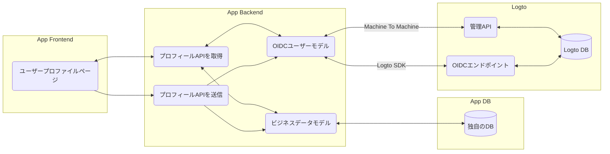

# 👤 ユーザープロフィール

以前のセクションでは、[管理コンソールを使用して](/docs/recipes/manage-users/admin-console)ユーザーを管理する方法、または[管理APIを介して](/docs/recipes/manage-users/management-api)ユーザーを管理する方法を示しました。これは管理者の役割を持つ人々にとっては簡単なプロセスです。しかし、一般ユーザーが自分自身のプロフィールを更新することも重要です。

これを実現するためには、管理APIの支援を受けて独自のプロフィールページを作成する必要があります。

## はじめに

:::tip

- Logtoの管理APIを呼び出すには、アプリにバックエンドサービスが必要です。
- アプリのバックエンドサービスが[Machine to Machine](/docs/recipes/integrate-logto/machine-to-machine)プロセスを通じてAPIキーとAPIシークレットのペアを取得していることを確認してください。

:::

お使いのアプリケーションにはフロントエンドとバックエンドの両方があり、バックエンドはM2Mメカニズムを通じてLogtoサービスに接続していると仮定します。

アプリのフロントエンドで、ユーザーがプロフィール情報（名前やメールアドレスなど）を入力するためのプロフィールページを作成します。通常、年齢、性別、社会保障番号、送付先住所、支払い方法などのビジネスモデルも含まれます。

その後、ほとんどの場合、全体のフローは次のようになります:

それでは、手順をまとめましょう:

### 独自のバックエンドサービスを用意する

アプリケーション用に独自のバックエンドAPIサービスを実装し、Logtoでユーザーリクエストを保護します（詳細は[APIを保護する](/docs/recipes/protect-your-api/)を参照）。

### ユーザープロフィールページを実装する

クライアントアプリケーションで、ユーザーのプロフィール用の新しいページを作成します。これはさまざまなフロントエンド開発フレームワークを使用して行うことができます。[SDKの統合ガイド](/docs/recipes/integrate-logto/)を確認し、お好きな言語を選んで開始してください。

通常は、事前にプロフィールデータを取得し、フォームフィールドを事前に入力することが推奨されます。これは、クライアントアプリケーションで以下の2つの関数を呼び出すことによって行うことができます（Logto SDKを統合して）:

- SDK関数 `getIdTokenClaims` を使用してIDトークンにキャッシュされた基本ユーザークレームをデコードすること
- SDK関数 `fetchUserInfo` を使用してLogtoサービスからユーザーデータを取得すること

または、M2Mメカニズムを通じて、バックエンドサービスから管理APIの `GET /api/users/:userId` を呼び出すこともできます。

### (オプション) 検証コードを検証する

ユーザーがメールアドレスまたは電話番号を変更したい場合、フォーム全体を送信する前にそれらを検証することが望ましいです。これにより、すべてのメールアドレスと電話番号がシステム内で検証され、アプリケーションでのパスワードレスサインイン方法（例: メールと検証コード）を有効にしたい場合に重要な役割を果たします。

これを行うには、次のようにするだけです:

- 管理コンソールでメールまたは電話のコネクタを構成する
- 上記のコネクタの構成で `Generic` 使用タイプのメッセージテンプレートを追加する

次に、バックエンドサービスから以下のLogto管理APIを呼び出してコードを送信し、検証することができます:

- `POST /api/verification-code` を使用して指定されたメールまたは電話に検証コードを送信する
- `POST /api/verification-code/verify` を使用して指定されたメールまたは電話でコードを検証する

:::tip
詳細については、[APIドキュメント](/api#tag/Verification-Codes)を参照してください。
:::

### プロフィールデータを送信する

ユーザーがプロフィールページでフォームを編集し終えたら、新しい変更を保存する時がきました。

通常、アプリのクライアントは独自のバックエンドサービスを呼び出し、新しいデータをリクエストボディで送ります。データを受け取った後、バックエンドサービスは、独自のビジネスモデルに応じてデータをLogtoまたは独自のデータベースに送信すべきです。

バックエンドサービスからM2Mを通じて `PATCH /api/users/:userId` を呼び出し、Logtoでユーザー情報を更新します。

## まとめ

ユーザープロフィールを実装することは複雑な作業かもしれません。最初は即席ソリューションを提供することを考えていましたが、徹底的に検討した結果、このアプローチは断念しました。ユーザープロフィールは通常、標準的なOpenID Connect（OIDC）ユーザークレームとビジネスモデルの独自の要件の組み合わせから成り立っています。そのため、最良のアプローチは、独自のカスタムプロフィールページとバックエンドサービスを作成し、それらをLogtoと接続することです。

要約すると:

- 独自のカスタムフロントエンドのプロフィールページとバックエンドサービスを開発する
- バックエンドサービスをM2M通信を介してLogtoに接続する
- Logtoの管理APIをLogtoとのやり取りに活用する