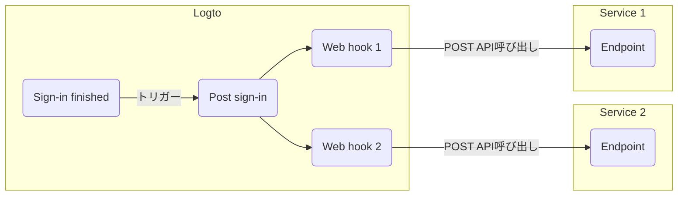

# 🪝 Web hooks / ウェブフック

## 概要

ウェブフックを使用すると、Logtoは開発者が他のサービスとイベントベースのやり取りを行うための次のレベルの拡張性を実現できます。

## 用語

### フックイベント

特定のアクションが行われると、特定のタイプのフックイベントがトリガーされます。たとえば、ユーザーがサインアッププロセスを完了し、新しいアカウントを作成すると、Logtoは `PostSignUp` フックイベントを発行します。

### フック

特定のイベントにフックする単一または複数のアクション。アクションはAPIの呼び出し、コードスニペットの実行などがあります。

### ウェブフック

イベントペイロードを使用してAPIを呼び出すことを示すフックのサブタイプ。

たとえば、開発者が新しいデバイスでユーザーがサインインしたときに通知を送信したい場合、開発者はウェブフックを追加し、そのセキュリティサービスAPIを `PostSignIn` イベントに呼び出すことができます。

以下はLogtoの `PostSignIn` イベントに対して2つのウェブフックを有効にする例です：



## ウェブフックの管理

現時点では、Logtoはウェブフックの管理を管理API経由でのみサポートしています。詳細な手順については、[🚝 管理APIとやり取りする](/docs/recipes/interact-with-management-api/)を参照してください。

標準のREST APIを使用してフックを管理できます：

```
POST /api/hooks
GET /api/hooks
GET /api/hooks/:id
PATCH /api/hooks/:id
PUT /api/hooks/:id
DELETE /api/hooks/:id
```

`GET /api/hooks` 以外のAPIは、フックエンティティをレスポンスボディに含んで返します。

フックエンティティの完全な定義：

```ts
type Hook = {
  id: string;
  /** フックをトリガーするイベント。 */
  event: HookEvent;
  config: HookConfig;
  createdAt: Date;
};

enum HookEvent {
  PostRegister = 'PostRegister',
  PostSignIn = 'PostSignIn',
  PostResetPassword = 'PostResetPassword',
}

type HookConfig = {
  /** リクエストを送信するURL、メソッドは `POST` に固定。 */
  url: string;
  /** リクエストに添付される追加ヘッダー。 */
  headers?: Record<string, string>;
  /**
   * フック応答ステータスが >= 500 の場合の再試行回数。
   *
   * `3` 以下である必要があります。再試行を無効にするには `0` を使用します。
   **/
  retries: number;
};
```

すべてのフックリクエストには、2つのデフォルトヘッダーが含まれます：

- 事前定義された値を持つ `user-agent`
- `content-type: application/json`

`headers`と同じキーを持つように渡すことでそれらを上書きできます。

### フックの作成

フックを作成するには `POST /api/hooks` を使用します。`event` と `config` のみが必要です。例：

```bash
curl --location  \
  --request POST 'https://<your-logto-endpoint>/api/hooks' \
  --header 'Authorization: Bearer eyJhbGciOiJS...' \
  --header 'Content-Type: application/json' \
  --data-raw '{
    "event": "PostSignIn",
    "config": {
      "url": "https://another.service.endpoint/path/to/api",
      "retries": 3
    }
  }'
```

### フックのクエリ

すべてのフックを取得するには `GET /api/hooks` を使用するか、単一のフックを取得するには `GET /api/hooks/:id` を使用します。例：

```bash
# 単一のフックを取得
curl --location
  --request GET 'https://<your-logto-endpoint>/api/hooks/2UT84OTmf9tT4F5vMhBnZ' \
  --header 'Authorization: Bearer eyJhbGciOiJS...'
```

### フックの更新

データの全置換を実行するには `PUT /api/hooks/:id` を、データの部分的な更新を実行するには `PATCH /api/hooks/:id` を使用します。例：

```bash
# 部分的な更新
curl --location  \
  --request PATCH 'https://<your-logto-endpoint>/api/hooks/2UT84OTmf9tT4F5vMhBnZ' \
  --header 'Authorization: Bearer eyJhbGciOiJS...' \
  --header 'Content-Type: application/json' \
  --data-raw '{
    "event": "PostRegister"
  }'
```

### フックの削除

既存のフックを削除するには `DELETE /api/hooks/:id` を使用します。

## ウェブフックリクエスト

有効なフックイベントが発行されると、Logtoは対応するウェブフックを検索し、リクエストボディで以下のJSONスキーマを使用して各フック設定に対して `POST` リクエストを送信します：

```ts
type HookEventPayload = {
  /** Logto内の識別子。 */
  hookId: string;
  /** このフックをトリガーするイベント。 */
  event: HookEvent;
  /** ペイロードの作成時刻（ISO形式）。 */
  createdAt: string;
  /** このイベントに応じたセッションID（適用される場合）。 */
  sessionId?: string;
  /** このフックをトリガーするリクエストのユーザーエージェント。 */
  userAgent?: string;
  /** このイベントに関連するユーザーID（適用される場合）。 */
  userId?: string;
  /** このイベントに関連するユーザーエンティティ（適用される場合）。 */
  user?: UserEntity;
  /** このイベントに関連するアプリケーション情報（適用される場合）。 */
  application?: Pick<Application, 'id' | 'type' | 'name' | 'description'>;
};
```

ユーザーデータから以下のフィールドを選択し、それらを `UserEntity` に構成します：

```ts
const fields = [
  'id',
  'username',
  'primaryEmail',
  'primaryPhone',
  'name',
  'avatar',
  'customData',
  'identities',
  'lastSignInAt',
  'createdAt',
  'applicationId',
  'isSuspended',
];
```

詳細なフィールドの説明については、[Users](/docs/references/users/) および [Applications](/docs/references/applications/) のリファレンスを参照してください。